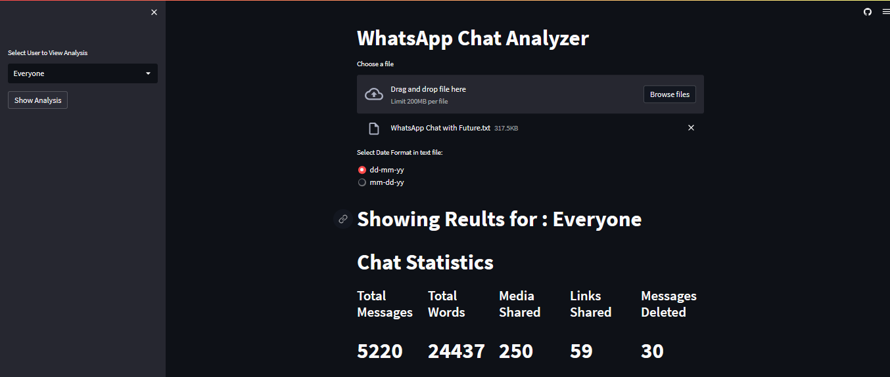

# WhatsApp Chat Analyzer




This repository contains the **WhatsApp Chat Analyzer** project, a tool that allows you to analyze and extract insights from WhatsApp chat exports. The project is developed by [Karan Prasad Gupta](https://github.com/karanprasadgupta), [Narayan Jha](https://github.com/kyayaarnarayan), and is written in Python.

## Table of Contents

- [Introduction](#introduction)
- [Demo](#demo)
- [Features](#features)
- [Installation](#installation)
- [Usage](#usage)
- [Examples](#examples)

## Introduction

The **WhatsApp Chat Analyzer** is designed to help you gain valuable insights from your WhatsApp chats. It provides various functionalities to analyze and visualize data extracted from the chat exports. This tool allows you to explore patterns, trends, and statistics related to your conversations, helping you understand your messaging behavior and communication patterns.

The project utilizes various open-source libraries and tools. See the [`requirements.txt`](https://github.com/karanprasadgupta/WhatsAppChatAnalzyer/blob/main/requirements.txt) file for details.

## Demo

Check out the live demo of the WhatsAppChatAnalzyer App:  [https://karanprasadgupta-whatsappchatanalzyer-main-lrxq8x.streamlit.app/](https://karanprasadgupta-whatsappchatanalzyer-main-lrxq8x.streamlit.app/)

> *If the website does not load properly, try opening it in incognito mode.*

## Features

- **Chat Data Extraction**: The analyzer can extract relevant information from WhatsApp chat exports, including message timestamps, senders, and message content.
- **Participant Analysis**: Gain insights into individual participants' activity, such as message count, average message length, and active hours.
- **Chat Statistics**: Get an overview of chat statistics, including total messages, media messages, and the most active day and time.
- **Word Cloud Generation**: Generate word clouds to visualize frequently used words in the chat.
- **Emoji Analysis**: Analyze the usage of emojis in the chat and generate insights about the most commonly used emojis.
- **Interactive Visualization**: Utilize interactive plots and graphs to visualize data and patterns.

## Installation

To get a local copy of this project up and running, follow these steps:

1. Clone this repository to your local machine using the following command:

   ```shell
   git clone https://github.com/karanprasadgupta/WhatsAppChatAnalzyer.git
   ```
2. Navigate to the project directory:
   ``` shell
   cd WhatsAppChatAnalzyer
   ```
3. Install the required dependencies:
   ``` shell
   pip install -r requirements.txt
   ```
4. Running the App:
   ``` shell
   streamlit run main.py
   ```
   This will start the app in the local environment

## Usage
- Export your WhatsApp chat conversation as a text file. You can find instructions on how to export chat logs on the WhatsApp website.
- Visit the  app [website](https://karanprasadgupta-whatsappchatanalzyer-main-lrxq8x.streamlit.app/) or run the app in local environment.
- Upload the chat text file on the server.
- Follow the on-screen instructions to choose the desired analysis options.

## Examples
Here are a few examples of how you can use the WhatsApp Chat Analyzer tool:
- Analyze chat statistics for a group chat over a specific time period.
- Generate a word cloud to visualize the most frequently used words in a one-on-one conversation.
- View active participation in a group chat among multiple participants.

> The WhatsAppChatAnalzyer App was developed just for learning purposes.
> 
> Feel free to customize and enhance the App according to your needs. Happy WhatsApp chat analysis!
